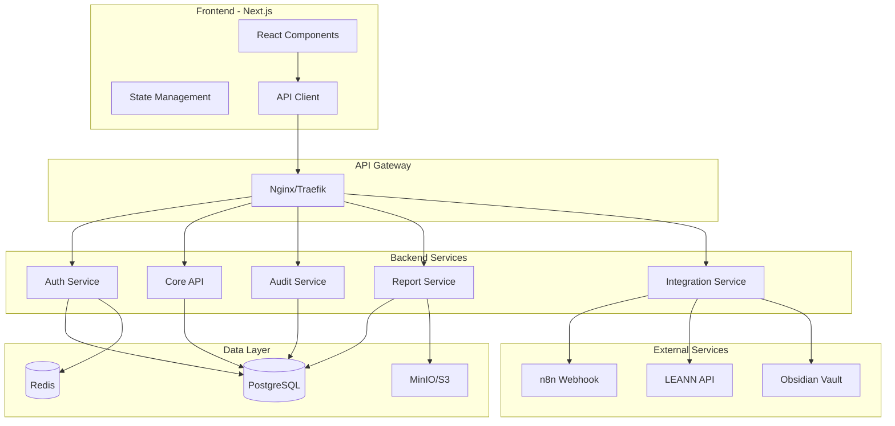

# Product Requirements Document (PRD)
# DPO2U MCP - Plataforma Web de Compliance LGPD/GDPR

**Versão:** 1.0
**Data:** 02/10/2025
**Status:** Em Elaboração
**Autor:** Time DPO2U

---

## 1. Resumo Executivo

### 1.1 Visão do Produto
A DPO2U Web Platform é uma aplicação web moderna que transforma o atual sistema CLI do DPO2U MCP em uma plataforma acessível via navegador, mantendo o princípio fundamental de trabalhar apenas com dados reais e evidências verificáveis para compliance LGPD/GDPR.

### 1.2 Proposta de Valor
- **Para:** Empresas que precisam gerenciar compliance LGPD/GDPR
- **Que:** Necessitam de uma ferramenta confiável baseada em evidências reais
- **Nossa solução:** É uma plataforma web que automatiza auditorias e gestão de compliance
- **Diferentemente:** De soluções que geram dados fictícios ou simulados
- **Nosso produto:** Trabalha exclusivamente com dados verificáveis e rastreáveis

### 1.3 Objetivos Principais
1. Transformar o CLI em interface web intuitiva
2. Manter integração com sistemas existentes (n8n, Obsidian, LEANN)
3. Adicionar dashboard visual para métricas de compliance
4. Implementar gestão multi-empresa
5. Criar sistema de notificações e alertas

---

## 2. Contexto e Problema

### 2.1 Situação Atual
- **Sistema CLI**: Requer conhecimento técnico para operação
- **Acesso limitado**: Apenas via terminal no servidor
- **Visualização**: Dados em formato texto sem dashboards
- **Multi-usuário**: Sem suporte para múltiplos usuários simultâneos

### 2.2 Problemas a Resolver
1. **Acessibilidade**: DPOs e gestores precisam acesso fácil sem CLI
2. **Visualização**: Necessidade de dashboards e gráficos interativos
3. **Colaboração**: Múltiplos usuários precisam trabalhar simultaneamente
4. **Automação**: Agendamento de auditorias e relatórios
5. **Mobilidade**: Acesso de qualquer lugar via navegador

### 2.3 Oportunidades
- Democratizar acesso à ferramenta de compliance
- Aumentar adoção por empresas não-técnicas
- Criar marketplace de templates de políticas
- Integrar com mais ferramentas empresariais

---

## 3. Usuários e Personas

### 3.1 Persona Primária: DPO/Encarregado
**Nome:** Marina Silva
**Cargo:** Data Protection Officer
**Idade:** 35 anos
**Background:** Advogada com especialização em proteção de dados

**Necessidades:**
- Dashboard executivo com métricas LGPD
- Gestão de evidências e documentos
- Geração de relatórios para ANPD
- Alertas de não-conformidades

**Frustrações:**
- Complexidade técnica do CLI
- Dificuldade em visualizar evolução
- Falta de colaboração com equipe

### 3.2 Persona Secundária: Gestor de TI
**Nome:** Carlos Mendes
**Cargo:** CTO
**Idade:** 42 anos
**Background:** Engenheiro com MBA

**Necessidades:**
- Integração com infraestrutura existente
- APIs para automação
- Monitoramento de segurança
- Controle de acessos

### 3.3 Persona Terciária: Auditor Externo
**Nome:** Ana Costa
**Cargo:** Auditora Independente
**Idade:** 38 anos
**Background:** Contadora com certificações

**Necessidades:**
- Acesso read-only para auditorias
- Exportação de evidências
- Trilha de auditoria completa
- Relatórios padronizados

---

## 4. Requisitos Funcionais

### 4.1 Autenticação e Autorização

#### RF001: Sistema de Login
- **Descrição:** Autenticação segura com email/senha
- **Critérios de Aceitação:**
  - Login com email corporativo
  - Senha forte obrigatória (min 12 caracteres)
  - 2FA via TOTP obrigatório para DPOs
  - Session timeout após 30min inatividade
- **Prioridade:** P0 - Crítica

#### RF002: Gestão de Perfis (RBAC)
- **Descrição:** Controle de acesso baseado em papéis
- **Papéis:**
  - Super Admin (acesso total)
  - DPO (gestão compliance)
  - Auditor (read-only + relatórios)
  - Operador (execução de tarefas)
  - Visualizador (dashboards apenas)
- **Prioridade:** P0 - Crítica

### 4.2 Dashboard Principal

#### RF003: Dashboard de Compliance
- **Descrição:** Visão geral do status LGPD
- **Componentes:**
  - Score de Compliance (0-100%)
  - Gráfico de evolução temporal
  - Alertas e pendências
  - Últimas auditorias
  - Próximas ações requeridas
- **Prioridade:** P0 - Crítica

#### RF004: Widget de Métricas em Tempo Real
- **Descrição:** Métricas coletadas do sistema
- **Dados:**
  - Containers Docker ativos
  - Serviços monitorados
  - Uso de recursos
  - Status de integrações
- **Prioridade:** P1 - Alta

### 4.3 Gestão de Empresas

#### RF005: Cadastro de Empresa
- **Descrição:** Wizard de configuração inicial
- **Campos:**
  - Dados básicos (CNPJ, razão social)
  - Informações de contato
  - Setor e porte
  - DPO designado
- **Prioridade:** P0 - Crítica

#### RF006: Multi-tenant Support
- **Descrição:** Gestão de múltiplas empresas
- **Funcionalidades:**
  - Switch entre empresas
  - Dados isolados por tenant
  - Configurações independentes
  - Billing separado
- **Prioridade:** P1 - Alta

### 4.4 Checklist LGPD

#### RF007: Interface do Checklist
- **Descrição:** Formulário interativo dos 44 itens
- **Features:**
  - Agrupamento por categoria
  - Progress bar visual
  - Upload de evidências inline
  - Comentários por item
  - Save automático
- **Prioridade:** P0 - Crítica

#### RF008: Gestão de Evidências
- **Descrição:** Sistema de upload e organização
- **Funcionalidades:**
  - Upload múltiplos arquivos
  - Visualizador de documentos
  - Versionamento
  - Tags e categorização
  - Busca full-text
- **Prioridade:** P0 - Crítica

### 4.5 Auditorias

#### RF009: Execução de Auditoria
- **Descrição:** Interface para rodar auditorias
- **Opções:**
  - Auditoria completa
  - Auditoria parcial (categorias)
  - Comparação temporal
  - Agendamento recorrente
- **Prioridade:** P0 - Crítica

#### RF010: Visualização de Resultados
- **Descrição:** Dashboard de resultados
- **Componentes:**
  - Score detalhado
  - Matriz de conformidade
  - Gaps identificados
  - Plano de ação sugerido
  - Timeline de evolução
- **Prioridade:** P0 - Crítica

### 4.6 Gestão de Riscos

#### RF011: Matriz de Riscos
- **Descrição:** Visualização e gestão de riscos
- **Features:**
  - Heatmap de riscos
  - Classificação (probabilidade x impacto)
  - Planos de mitigação
  - Responsáveis e prazos
  - Histórico de tratamento
- **Prioridade:** P1 - Alta

#### RF012: Alertas Automáticos
- **Descrição:** Sistema de notificações
- **Triggers:**
  - Riscos críticos detectados
  - Vulnerabilidades encontradas
  - Prazos vencendo
  - Score caindo
- **Prioridade:** P1 - Alta

### 4.7 Relatórios

#### RF013: Gerador de Relatórios
- **Descrição:** Criação de relatórios customizados
- **Tipos:**
  - Relatório DPO mensal
  - Relatório para ANPD
  - Relatório executivo
  - Relatório técnico
  - Relatório de incidentes
- **Prioridade:** P0 - Crítica

#### RF014: Exportação de Dados
- **Descrição:** Export em múltiplos formatos
- **Formatos:**
  - PDF com assinatura digital
  - Excel com dados estruturados
  - JSON para integração
  - Markdown para Obsidian
- **Prioridade:** P1 - Alta

### 4.8 Integrações

#### RF015: Integração n8n
- **Descrição:** Manter webhook existente
- **Funcionalidades:**
  - Envio automático de relatórios
  - Recebimento de triggers
  - Status de workflows
  - Logs de integração
- **Prioridade:** P0 - Crítica

#### RF016: Integração LEANN
- **Descrição:** Busca semântica integrada
- **Features:**
  - Search bar inteligente
  - Sugestões contextuais
  - Links relacionados
  - Cache de resultados
- **Prioridade:** P1 - Alta

#### RF017: Integração Obsidian
- **Descrição:** Sincronização com vault
- **Funcionalidades:**
  - Visualização de documentos
  - Edição colaborativa
  - Sync bidirecional
  - Backup automático
- **Prioridade:** P2 - Média

### 4.9 Configurações

#### RF018: Gestão de Usuários
- **Descrição:** CRUD de usuários
- **Features:**
  - Convite por email
  - Definição de papéis
  - Logs de acesso
  - Reset de senha
  - Desativação/reativação
- **Prioridade:** P0 - Crítica

#### RF019: Configurações da Empresa
- **Descrição:** Personalização por tenant
- **Opções:**
  - Logo e cores
  - Políticas de senha
  - Integrações ativas
  - Webhooks customizados
  - Timezone e idioma
- **Prioridade:** P1 - Alta

---

## 5. Requisitos Não-Funcionais

### 5.1 Performance
- **RNF001:** Tempo de resposta < 2s para 95% das requisições
- **RNF002:** Suporte a 100 usuários simultâneos
- **RNF003:** Dashboard carrega em < 3s
- **RNF004:** Upload de arquivos até 100MB

### 5.2 Segurança
- **RNF005:** HTTPS obrigatório (TLS 1.3+)
- **RNF006:** Criptografia AES-256 para dados sensíveis
- **RNF007:** OWASP Top 10 compliance
- **RNF008:** Audit logs imutáveis
- **RNF009:** Backup automático diário

### 5.3 Disponibilidade
- **RNF010:** SLA 99.9% uptime
- **RNF011:** RPO < 1 hora
- **RNF012:** RTO < 4 horas
- **RNF013:** Zero downtime deployment

### 5.4 Usabilidade
- **RNF014:** Interface responsiva (mobile-first)
- **RNF015:** WCAG 2.1 Level AA compliance
- **RNF016:** Suporte a Chrome, Firefox, Safari, Edge
- **RNF017:** Internacionalização (PT-BR, EN, ES)

### 5.5 Manutenibilidade
- **RNF018:** Cobertura de testes > 80%
- **RNF019:** Documentação API OpenAPI 3.0
- **RNF020:** CI/CD pipeline automatizado
- **RNF021:** Monitoramento APM (Grafana)

---

## 6. Arquitetura Técnica

### 6.1 Stack Tecnológico

#### Frontend
```yaml
Framework: Next.js 15
Language: TypeScript
UI Library: shadcn/ui + Tailwind CSS
State Management: Zustand
Forms: React Hook Form + Zod
Charts: Recharts
Testing: Jest + React Testing Library
```

#### Backend
```yaml
Runtime: Node.js 20 LTS
Framework: Express.js / Fastify
Language: TypeScript
ORM: Prisma
Queue: Bull + Redis
Cache: Redis
Testing: Jest + Supertest
```

#### Database
```yaml
Primary: PostgreSQL 15
Cache: Redis 7
File Storage: MinIO / S3
Search: LEANN (existing)
```

#### Infrastructure
```yaml
Container: Docker
Orchestration: Docker Compose
Proxy: Traefik (existing)
Monitoring: Prometheus + Grafana (existing)
Logs: Loki + Promtail
```

### 6.2 Arquitetura de Componentes



### 6.3 Modelo de Dados Principal

```sql
-- Empresas
CREATE TABLE companies (
    id UUID PRIMARY KEY,
    cnpj VARCHAR(18) UNIQUE NOT NULL,
    name VARCHAR(255) NOT NULL,
    email VARCHAR(255),
    phone VARCHAR(20),
    address TEXT,
    website VARCHAR(255),
    sector VARCHAR(100),
    size VARCHAR(50),
    created_at TIMESTAMP,
    updated_at TIMESTAMP
);

-- Usuários
CREATE TABLE users (
    id UUID PRIMARY KEY,
    email VARCHAR(255) UNIQUE NOT NULL,
    password_hash VARCHAR(255) NOT NULL,
    name VARCHAR(255),
    role VARCHAR(50),
    company_id UUID REFERENCES companies(id),
    two_factor_secret VARCHAR(255),
    is_active BOOLEAN DEFAULT true,
    created_at TIMESTAMP,
    last_login TIMESTAMP
);

-- Checklist Responses
CREATE TABLE checklist_responses (
    id UUID PRIMARY KEY,
    company_id UUID REFERENCES companies(id),
    checklist_item_id VARCHAR(10),
    response CHAR(2), -- s, n, p, na
    evidence_path TEXT,
    comments TEXT,
    responded_by UUID REFERENCES users(id),
    responded_at TIMESTAMP,
    updated_at TIMESTAMP
);

-- Auditorias
CREATE TABLE audits (
    id UUID PRIMARY KEY,
    company_id UUID REFERENCES companies(id),
    audit_type VARCHAR(50),
    compliance_score INTEGER,
    status VARCHAR(50),
    findings JSONB,
    evidence_paths TEXT[],
    created_by UUID REFERENCES users(id),
    created_at TIMESTAMP,
    completed_at TIMESTAMP
);

-- Evidências
CREATE TABLE evidences (
    id UUID PRIMARY KEY,
    company_id UUID REFERENCES companies(id),
    file_name VARCHAR(255),
    file_path TEXT,
    file_size BIGINT,
    mime_type VARCHAR(100),
    checksum VARCHAR(64),
    uploaded_by UUID REFERENCES users(id),
    uploaded_at TIMESTAMP,
    tags TEXT[],
    is_deleted BOOLEAN DEFAULT false
);
```

---

## 7. Interfaces de Usuário (Mockups)

### 7.1 Tela de Login
```
┌──────────────────────────────────┐
│         DPO2U Compliance         │
│                                  │
│    ┌────────────────────┐        │
│    │ email@empresa.com  │        │
│    └────────────────────┘        │
│                                  │
│    ┌────────────────────┐        │
│    │ ••••••••••••      │        │
│    └────────────────────┘        │
│                                  │
│    [✓] Lembrar de mim            │
│                                  │
│    ┌────────────────────┐        │
│    │     ENTRAR         │        │
│    └────────────────────┘        │
│                                  │
│    Esqueceu a senha?             │
└──────────────────────────────────┘
```

### 7.2 Dashboard Principal
```
┌─────────────────────────────────────────┐
│ DPO2U  │ Dashboard │ Auditorias │ Config │
├─────────────────────────────────────────┤
│                                         │
│  Score de Compliance: 78%              │
│  ████████████████░░░░░                 │
│                                         │
│  ┌─────────┐ ┌─────────┐ ┌─────────┐  │
│  │ 3 Gaps  │ │12 Evid. │ │ 2 Risks │  │
│  └─────────┘ └─────────┘ └─────────┘  │
│                                         │
│  Evolução Mensal                       │
│  ┌─────────────────────────┐           │
│  │     📊 Gráfico          │           │
│  └─────────────────────────┘           │
│                                         │
│  Últimas Atividades                    │
│  • Auditoria completa - 02/10          │
│  • Nova evidência adicionada           │
│  • Checklist atualizado                │
└─────────────────────────────────────────┘
```

### 7.3 Checklist LGPD
```
┌──────────────────────────────────────────┐
│ Checklist LGPD - 44 itens               │
├──────────────────────────────────────────┤
│                                          │
│ ▼ Governança (8/8) ━━━━━━━━━━ 100%      │
│   ✅ GOV001 - DPO Designado             │
│   ✅ GOV002 - Política de Privacidade   │
│   ✅ GOV003 - Inventário de Dados       │
│                                          │
│ ▼ Gestão de Dados (7/10) ━━━━━ 70%      │
│   ✅ GES001 - Base Legal Definida       │
│   ❌ GES002 - Minimização de Dados      │
│      [Adicionar Evidência]               │
│   ⚠️  GES003 - Retenção de Dados        │
│      [Upload] política-retencao.pdf      │
│                                          │
│ Score Total: 78% (34/44 conformidades)  │
│                                          │
│ [Salvar] [Executar Auditoria]           │
└──────────────────────────────────────────┘
```

---

## 8. APIs e Integrações

### 8.1 API RESTful

#### Endpoints Principais
```yaml
Authentication:
  POST   /api/auth/login
  POST   /api/auth/logout
  POST   /api/auth/refresh
  GET    /api/auth/me

Companies:
  GET    /api/companies
  GET    /api/companies/:id
  POST   /api/companies
  PUT    /api/companies/:id
  DELETE /api/companies/:id

Checklist:
  GET    /api/companies/:id/checklist
  PUT    /api/companies/:id/checklist/:itemId
  POST   /api/companies/:id/checklist/bulk

Audits:
  GET    /api/companies/:id/audits
  POST   /api/companies/:id/audits
  GET    /api/audits/:id
  GET    /api/audits/:id/report

Evidence:
  GET    /api/companies/:id/evidence
  POST   /api/companies/:id/evidence
  GET    /api/evidence/:id
  DELETE /api/evidence/:id

Reports:
  POST   /api/reports/generate
  GET    /api/reports/:id
  GET    /api/reports/:id/download

Integrations:
  POST   /api/webhooks/test
  GET    /api/integrations/status
  POST   /api/search
```

### 8.2 WebSocket Events

```javascript
// Real-time updates
socket.on('audit:started', (data) => {})
socket.on('audit:progress', (data) => {})
socket.on('audit:completed', (data) => {})
socket.on('evidence:uploaded', (data) => {})
socket.on('score:updated', (data) => {})
```

### 8.3 Webhook Payloads

```json
// Para n8n
{
  "event": "audit.completed",
  "timestamp": "2025-10-02T15:30:00Z",
  "company_id": "uuid",
  "data": {
    "audit_id": "uuid",
    "compliance_score": 78,
    "gaps_found": 10,
    "evidence_count": 34
  }
}
```

---

## 9. Roadmap de Implementação

### 9.1 Fase 1: MVP (3 meses)
**Objetivo:** Versão web básica funcionando

**Sprints 1-2: Foundation**
- Setup do projeto
- Autenticação e autorização
- Estrutura de banco de dados
- CI/CD pipeline

**Sprints 3-4: Core Features**
- Cadastro de empresas
- Checklist LGPD interativo
- Upload de evidências
- Dashboard básico

**Sprints 5-6: Integration**
- Integração com n8n existente
- Migração dados do CLI
- Testes e debugging
- Deploy em staging

### 9.2 Fase 2: Enhancement (2 meses)
**Objetivo:** Features avançadas e UX

**Sprints 7-8: Advanced Features**
- Matriz de riscos
- Relatórios customizados
- Agendamento de auditorias
- Notificações e alertas

**Sprints 9-10: Polish**
- Melhorias de UX/UI
- Performance optimization
- Mobile responsive
- Documentação

### 9.3 Fase 3: Scale (2 meses)
**Objetivo:** Preparar para produção

**Sprints 11-12: Production Ready**
- Multi-tenant completo
- Billing e planos
- API pública
- Marketplace de templates

**Sprints 13-14: Launch**
- Security audit
- Load testing
- Training materials
- Go-live

---

## 10. Métricas de Sucesso

### 10.1 KPIs Técnicos
- **Disponibilidade:** > 99.9%
- **Tempo de resposta:** < 2s (P95)
- **Taxa de erro:** < 0.1%
- **Cobertura de testes:** > 80%

### 10.2 KPIs de Produto
- **Usuários ativos mensais:** 100 em 6 meses
- **Empresas cadastradas:** 50 em 6 meses
- **Auditorias executadas:** 500/mês
- **Score médio de compliance:** Aumento de 20%

### 10.3 KPIs de Negócio
- **Conversão trial-to-paid:** > 30%
- **Churn rate:** < 5% mensal
- **NPS:** > 50
- **CAC/LTV:** < 1:3

---

## 11. Riscos e Mitigações

### 11.1 Riscos Técnicos

| Risco | Probabilidade | Impacto | Mitigação |
|-------|--------------|---------|-----------|
| Migração de dados falha | Média | Alto | Backup completo + rollback plan |
| Performance degradada | Baixa | Alto | Cache agressivo + CDN |
| Integração LEANN instável | Média | Médio | Fallback para busca local |
| Segurança comprometida | Baixa | Crítico | Pentest + bug bounty |

### 11.2 Riscos de Produto

| Risco | Probabilidade | Impacto | Mitigação |
|-------|--------------|---------|-----------|
| Baixa adoção | Média | Alto | Onboarding assistido + trial |
| Complexidade alta | Média | Médio | UX research + testes |
| Falta de features | Baixa | Médio | Feedback loops + iteração |

---

## 12. Considerações Finais

### 12.1 Premissas
- Infraestrutura atual (Docker, Traefik) será mantida
- Integração com n8n continuará funcional
- LEANN API permanecerá disponível
- Equipe terá 4-6 desenvolvedores

### 12.2 Restrições
- Orçamento limitado para infraestrutura
- Prazo de 7 meses para go-live
- Compatibilidade com sistema legado
- Conformidade LGPD obrigatória

### 12.3 Dependências
- Aprovação do design system
- Disponibilidade da equipe
- Licenças de software
- Certificado SSL wildcard

### 12.4 Próximos Passos
1. Validação do PRD com stakeholders
2. Criação de protótipos de alta fidelidade
3. Definição da arquitetura detalhada
4. Setup do ambiente de desenvolvimento
5. Início do Sprint 1

---

## 13. Anexos

### A. Checklist LGPD Completo (44 itens)
[Disponível em: /opt/dpo2u-mcp/src/initialization/companySetup.js]

### B. Estrutura de Webhooks n8n
[Disponível em: /opt/dpo2u-mcp/src/integrations/n8nWebhook.js]

### C. Mockups Detalhados
[A serem criados no Figma]

### D. Especificação da API
[OpenAPI 3.0 spec a ser desenvolvida]

### E. Plano de Testes
[Documento separado a ser criado]

---

**Documento elaborado por:** Time DPO2U
**Data:** 02/10/2025
**Versão:** 1.0
**Status:** Para Aprovação

---

*Este PRD é um documento vivo e será atualizado conforme o projeto evolui.*